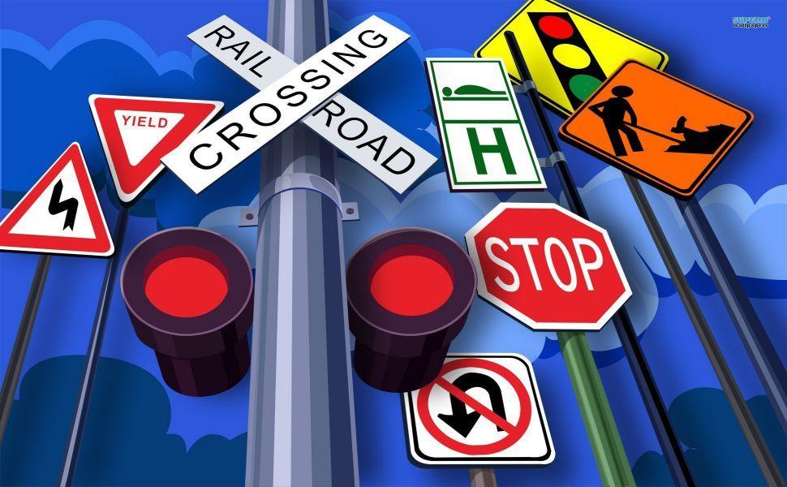

# GTSRB - German Traffic Sign Recognition Benchmark
Using Deep-learning and Computer vision to accurately detect and classify traffic sign images.

https://medium.com/@vagadia49

## Introduction :
________________________________________________________________________

Traffic signs are an integral part of our road infrastructure. Without such useful signs, we would most likely be faced with more accidents, as drivers would not be given critical feedback on how fast they could safely go, or informed about road works, sharp turn, or school crossings ahead.

Naturally, autonomous vehicles must also abide by road legislation and therefore recognize and understand traffic signs.

The goal of traffic sign detection is to identify the region of interest (ROI) in which a traffic sign is supposed to be found and verify the sign after a large-scale search for candidates within an image.

It has a very major role to play in self-driving cars, which is the future of automobile industry.

Please visit this kaggle page for downloading the dataset :
[GTSRB - German Traffic Sign Recognition Benchmark](https://www.kaggle.com/meowmeowmeowmeowmeow/gtsrb-german-traffic-sign)

## Final Scores :
Test Weighted F1-Score : 0.98
Test MSE for bounding box : 0.62